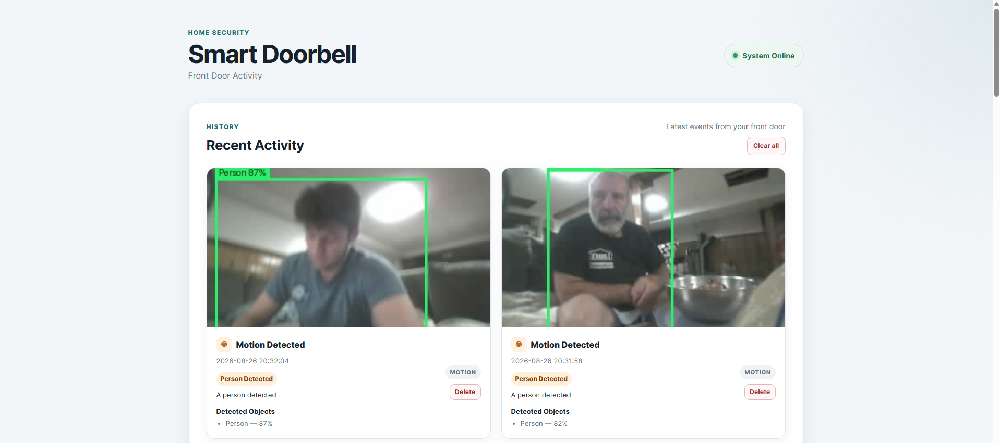
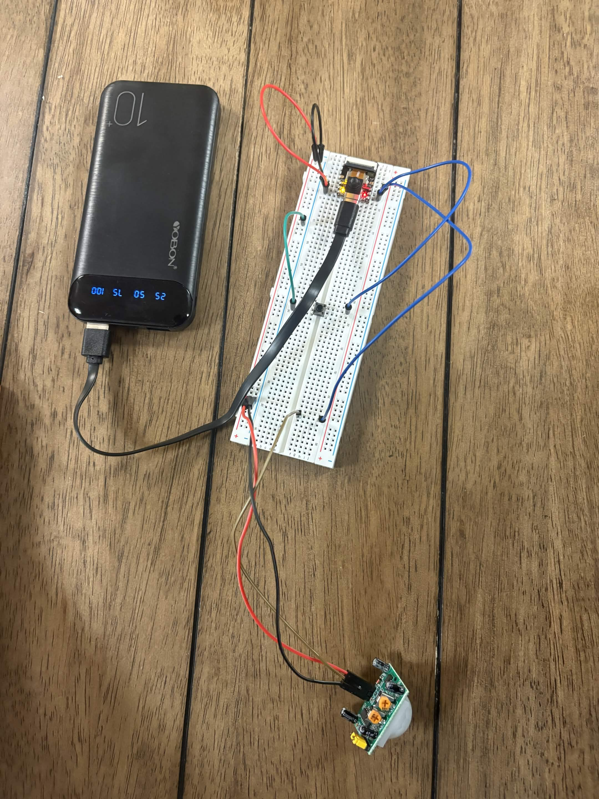
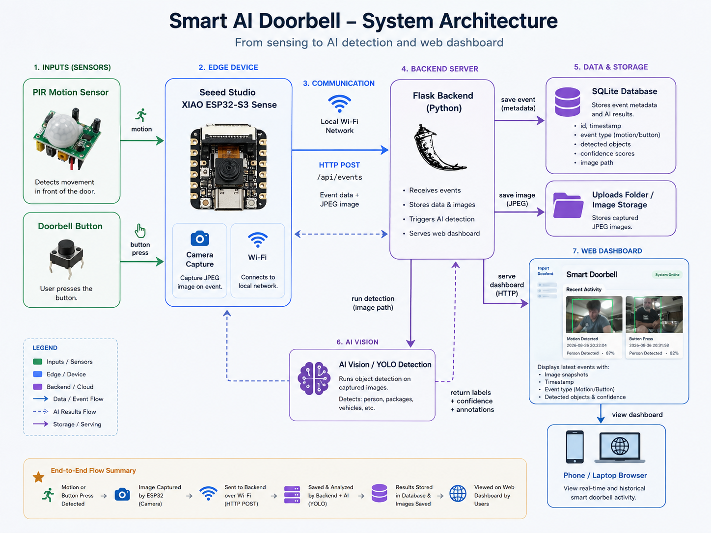

# AI-Powered Smart Doorbell

An end-to-end smart doorbell built with a **Seeed Studio XIAO ESP32-S3 Sense**, PIR motion sensor, physical pushbutton, Flask backend, SQLite database, and YOLO computer vision.

The device captures an image when motion is detected or the doorbell is pressed, sends the image over Wi-Fi to a Flask server, runs AI object detection, stores the event, and displays the results on a live web dashboard.

---

## Project Preview



The dashboard displays:

- Motion and doorbell events
- Captured images
- Timestamps
- Person detection
- Detected objects
- Confidence scores
- Bounding boxes
- Event deletion
- Automatic refresh

---

## Hardware Prototype



### Hardware

- Seeed Studio XIAO ESP32-S3 Sense
- Integrated camera
- HC-SR501 PIR motion sensor
- Momentary pushbutton
- Breadboard
- Jumper wires
- USB-C power source

### Main Connections

| Component | Connection |
|---|---|
| Pushbutton | D1 → Pushbutton → GND |
| PIR OUT | D2 |
| PIR VCC | VBUS / 5V |
| PIR GND | GND |

---

## System Architecture



### System Flow

```text
PIR Motion / Button Press
          ↓
XIAO ESP32-S3 Sense
          ↓
Capture JPEG
          ↓
Wi-Fi / HTTP POST
          ↓
Flask Backend
      ↙       ↘
   YOLO       SQLite
      ↓
AI Detection Results
          ↓
Web Dashboard
```

---

## Features

### Embedded Firmware
- C++ / Arduino
- GPIO interrupts
- PIR warm-up and cooldown logic
- ESP32-S3 camera capture
- PSRAM image buffering
- Wi-Fi reconnection
- Multipart HTTP image upload
- TCP chunking
- Automatic upload retries

### Backend
- Python Flask REST API
- SQLite event storage
- JPEG image storage
- Individual event deletion
- Delete All functionality
- Health-check endpoint

### AI Vision
- YOLO object detection
- Person detection
- Person counting
- Confidence scores
- Bounding boxes
- Annotated images

### Frontend
- HTML
- CSS
- JavaScript
- Automatic event refresh
- AI detection results
- Motion / doorbell labels
- Event management

---

## How It Works

1. The PIR sensor detects motion or the physical doorbell button is pressed.
2. The ESP32-S3 captures a JPEG using its onboard camera.
3. The image and event type are sent over Wi-Fi to Flask using `POST /api/events`.
4. Flask saves the image and runs YOLO object detection.
5. Event metadata and AI results are stored in SQLite.
6. The dashboard retrieves the latest events and updates automatically.

---

## Engineering Challenges

Several issues had to be solved while integrating the hardware and software:

- **Camera memory:** The camera initially failed because PSRAM was not enabled. Enabling **OPI PSRAM** provided enough memory for the JPEG frame buffer.
- **Missed button presses:** Camera and network operations could block the main loop, so hardware interrupts were added to capture short button events reliably.
- **Unreliable image uploads:** JPEG transmission was improved using smaller TCP chunks, stall detection, and automatic full-upload retries.
- **Wi-Fi reliability:** Testing showed about **-80 dBm** signal strength at the original location compared with about **-58 dBm** closer to the router, helping identify weak Wi-Fi as a major source of connection failures.
- **AI processing:** YOLO runs on the Flask server rather than the ESP32, keeping the embedded device focused on sensing, camera capture, and networking.

---

## Technology Stack

**Embedded:** C++, Arduino, ESP32-S3  
**Backend:** Python, Flask  
**Computer Vision:** YOLO  
**Database:** SQLite  
**Frontend:** HTML, CSS, JavaScript  
**Networking:** Wi-Fi, HTTP, multipart/form-data

---

## Project Structure

```text
smart-doorbell/
│
├── firmware/
│   └── smart_doorbell.ino
│
├── static/
│   ├── style.css
│   └── script.js
│
├── templates/
│   └── index.html
│
├── docs/
│   ├── ai-dashboard.png
│   ├── hardware-prototype.jpg
│   └── system-architecture.png
│
├── uploads/
│
├── app.py
├── database.py
├── vision.py
├── README.md
├── .gitignore
└── .gitattributes
```

---

## Future Improvements

- 3D-printed enclosure
- Final wall-mounted prototype
- Push notifications for person detection
- Improved Wi-Fi coverage
- User authentication
- Remote access
- Improved low-light image quality
- Final demonstration video

---

## Demo

A full demo video will be added once the final enclosure is completed.

The final demonstration will show:

```text
Motion / Button Press
        ↓
Image Capture
        ↓
Wi-Fi Upload
        ↓
YOLO Detection
        ↓
Annotated Event on Dashboard
```
